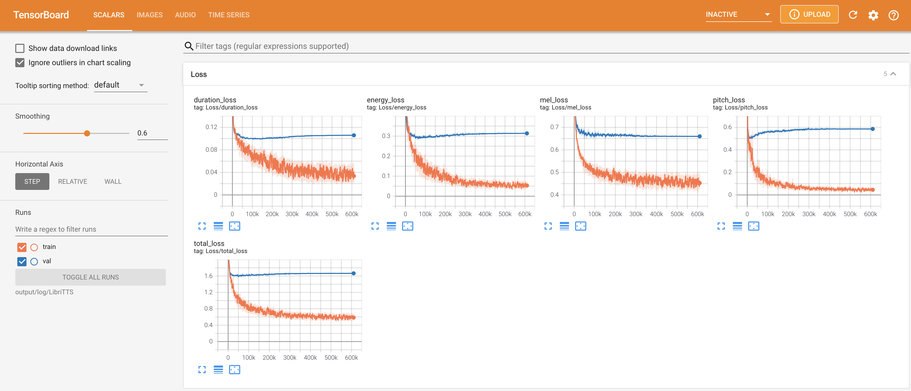
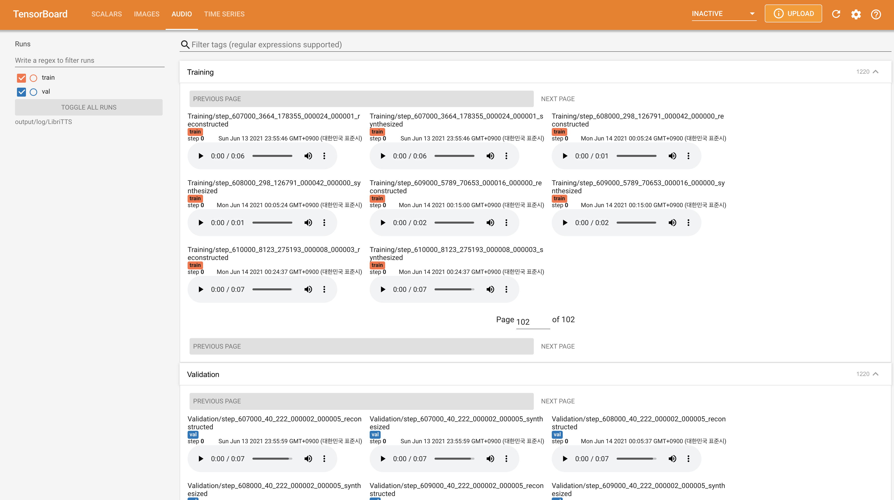

# StyleSpeech - PyTorch Implementation

PyTorch Implementation of [Meta-StyleSpeech : Multi-Speaker Adaptive Text-to-Speech Generation](https://arxiv.org/abs/2106.03153). 

<p align="center">
    
</p>

<p align="center">
    
</p>

# Quickstart

## Dependencies
You can install the Python dependencies with
```
pip3 install -r requirements.txt
```

## Inference

You have to download the [pretrained models](https://drive.google.com/drive/folders/1fQmu1v7fRgfM-TwxAJ96UUgnl79f1FHt?usp=sharing) and put them in ``output/ckpt/LibriTTS/``.

For English single-speaker TTS, run
```
python3 synthesize.py --text "YOUR_DESIRED_TEXT" --ref_audio path/to/reference_audio.wav --speaker_id <SPEAKER_ID> --restore_step 100000 --mode single -p config/LibriTTS/preprocess.yaml -m config/LibriTTS/model.yaml -t config/LibriTTS/train.yaml
```
The generated utterances will be put in ``output/result/``. Your synthesized speech will have `ref_audio`'s style spoken by `speaker_id` speaker. Note that the controllability of speakers is not a vital interest of StyleSpeech.


## Batch Inference
Batch inference is also supported, try

```
python3 synthesize.py --source preprocessed_data/LibriTTS/val.txt --restore_step 100000 --mode batch -p config/LibriTTS/preprocess.yaml -m config/LibriTTS/model.yaml -t config/LibriTTS/train.yaml
```
to synthesize all utterances in ``preprocessed_data/LibriTTS/val.txt``. This can be viewed as a reconstruction of validation datasets referring to themselves for the reference style.

## Controllability
The pitch/volume/speaking rate of the synthesized utterances can be controlled by specifying the desired pitch/energy/duration ratios.
For example, one can increase the speaking rate by 20 % and decrease the volume by 20 % by

```
python3 synthesize.py --text "YOUR_DESIRED_TEXT" --restore_step 100000 --mode single -p config/LibriTTS/preprocess.yaml -m config/LibriTTS/model.yaml -t config/LibriTTS/train.yaml --duration_control 0.8 --energy_control 0.8
```
Note that the controllability is originated from FastSpeech2 and not a vital interest of StyleSpeech.

# Training

## Datasets

The supported datasets are

- [LibriTTS](https://research.google/tools/datasets/libri-tts/): a multi-speaker English dataset containing 585 hours of speech by 2456 speakers.
- (will be added more)

## Preprocessing
 
First, run 
```
python3 prepare_align.py config/LibriTTS/preprocess.yaml
```
for some preparations.

In this implementation, [Montreal Forced Aligner](https://montreal-forced-aligner.readthedocs.io/en/latest/) (MFA) is used to obtain the alignments between the utterances and the phoneme sequences.

Download the official MFA package and run
```
./montreal-forced-aligner/bin/mfa_align raw_data/LibriTTS/ lexicon/librispeech-lexicon.txt english preprocessed_data/LibriTTS
```
or
```
./montreal-forced-aligner/bin/mfa_train_and_align raw_data/LibriTTS/ lexicon/librispeech-lexicon.txt preprocessed_data/LibriTTS
```

to align the corpus and then run the preprocessing script.
```
python3 preprocess.py config/LibriTTS/preprocess.yaml
```

## Training

Train your model with
```
python3 train.py -p config/LibriTTS/preprocess.yaml -m config/LibriTTS/model.yaml -t config/LibriTTS/train.yaml
```

# TensorBoard

Use
```
tensorboard --logdir output/log/LibriTTS
```

to serve TensorBoard on your localhost.
The loss curves, synthesized mel-spectrograms, and audios are shown.





# Implementation Issues

1. Use `22050Hz` sampling rate instead of `16kHz`. 
2. Add one fully connected layer at the beginning of Mel-Style Encoder to upsample input mel-spectrogram from `80` to `128`.
3. The Paper doesn't mention speaker embedding for the **Generator**, but I add it as a normal multi-speaker TTS. And the `style_prototype` of Meta-StyleSpeech can be seen as a speaker embedding space.
4. Use **HiFi-GAN** instead of **MelGAN** for vocoding.

# Citation

```
@misc{lee2021stylespeech,
  author = {Lee, Keon},
  title = {StyleSpeech},
  year = {2021},
  publisher = {GitHub},
  journal = {GitHub repository},
  howpublished = {\url{https://github.com/keonlee9420/StyleSpeech}}
}
```

# References
- [Meta-StyleSpeech : Multi-Speaker Adaptive Text-to-Speech Generation](https://arxiv.org/abs/2106.03153)
- [ming024's FastSpeech2](https://github.com/ming024/FastSpeech2)
